# Codeduck - Submission Service

Submission Service is a TypeScript/Express microservice for accepting code submissions, validating the target problem, persisting submission records in MongoDB, and publishing evaluation work to a Redis-backed BullMQ queue.

The repository currently contains the submission domain layer, queue producer, persistence model, infrastructure configuration, logging, validation helpers, and health/ping HTTP routes. Submission HTTP routes/controllers are not wired yet; the core submission workflow is implemented in `src/services/submission.service.ts`.

## Table of Contents

- [Architecture](#architecture)
- [Technology Stack](#technology-stack)
- [Project Structure](#project-structure)
- [Runtime Configuration](#runtime-configuration)
- [Getting Started](#getting-started)
- [Available Scripts](#available-scripts)
- [HTTP Routes](#http-routes)
- [Submission Model](#submission-model)
- [Process Flows](#process-flows)
- [Queue Behavior](#queue-behavior)
- [Logging and Correlation IDs](#logging-and-correlation-ids)
- [Error Handling](#error-handling)
- [Development Notes](#development-notes)

## Architecture

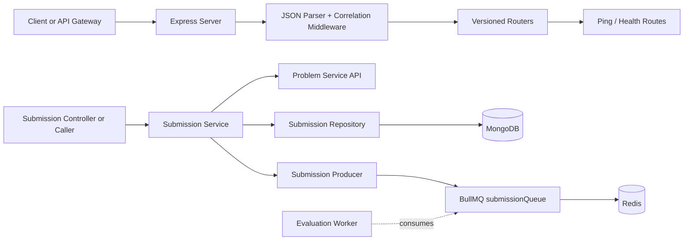

The intended service boundary is:

- Express owns HTTP transport, routing, request parsing, correlation IDs, and error middleware.
- `SubmissionService` owns business orchestration for submissions.
- `SubmissionRepository` owns MongoDB access through Mongoose.
- `submission.producer.ts` owns queue publishing.
- `submission.queue.ts` owns BullMQ queue construction and retry configuration.
- `problem.api.ts` owns calls to the external Problem Service.

## Technology Stack

| Area | Technology / Library | Usage |
| --- | --- | --- |
| Runtime | Node.js | JavaScript runtime for the service |
| Language | TypeScript | Strictly typed application code |
| HTTP Server | Express 5 | API server, routers, middleware |
| Database | MongoDB | Stores submission records |
| ODM | Mongoose | Submission schema, indexes, CRUD operations |
| Queue | BullMQ | Publishes submission evaluation jobs |
| Queue Broker | Redis | BullMQ backing store and queue coordination |
| Redis Client | ioredis | Redis connections for queue infrastructure |
| HTTP Client | Axios | Fetches problem details from Problem Service |
| Validation | Zod | Request body/query validation helpers |
| Logging | Winston | Structured JSON logs |
| Log Rotation | winston-daily-rotate-file | Daily log files under `logs/` |
| Request Context | AsyncLocalStorage | Stores per-request correlation IDs |
| IDs | uuid | Generates correlation IDs |
| Dev Runner | nodemon | Restarts service during development |
| TS Runner | ts-node | Runs TypeScript directly |

## Project Structure

```text
src/
  apis/
    problem.api.ts                # Problem Service HTTP client
  config/
    db.config.ts                  # MongoDB connection helper
    index.ts                      # Environment-backed server config
    logger.config.ts              # Winston logger
    redis.config.ts               # Redis connection factory
  controllers/
    ping.controller.ts            # Ping route handler
  middlewares/
    correlation.middleware.ts     # Request correlation ID setup
    error.middleware.ts           # App and generic error handlers
  models/
    submission.model.ts           # Mongoose submission schema
  producers/
    submission.producer.ts        # Adds submission jobs to BullMQ
  queues/
    submission.queue.ts           # BullMQ queue definition
  repositories/
    submission.repository.ts      # Submission persistence interface/class
  routers/
    v1/
      index.router.ts             # v1 router mount
      ping.router.ts              # Ping and health endpoints
    v2/
      index.router.ts             # v2 router placeholder
  services/
    submission.service.ts         # Submission business workflow
  utils/
    errors/app.error.ts           # Custom app errors
    helpers/request.helpers.ts    # AsyncLocalStorage helper
  validators/
    index.ts                      # Zod middleware helpers
    ping.validator.ts             # Ping body schema
```

## Runtime Configuration

The service reads environment variables through `dotenv`.

| Variable | Default | Description |
| --- | --- | --- |
| `PORT` | `3001` | Port used by the Express server |
| `DB_URL` | `mongodb://localhost:27017/problem-service` | MongoDB connection string |
| `PROBLEM_SERVICE_URL` | `http://localhost:3000/api/v1` | Base URL for the Problem Service |
| `REDIS_HOST` | `localhost` | Redis host used by ioredis/BullMQ |
| `REDIS_PORT` | `6379` | Redis port used by ioredis/BullMQ |

Example `.env`:

```env
PORT=3001
DB_URL=mongodb://localhost:27017/submission-service
PROBLEM_SERVICE_URL=http://localhost:3000/api/v1
REDIS_HOST=localhost
REDIS_PORT=6379
```

## Getting Started

Install dependencies:

```bash
npm install
```

Start MongoDB and Redis locally, then run the service:

```bash
npm run dev
```

For a non-restarting local run:

```bash
npm start
```

The server listens on:

```text
http://localhost:3001
```

or the value configured through `PORT`.

## Available Scripts

| Script | Command | Description |
| --- | --- | --- |
| `npm start` | `ts-node src/server.ts` | Runs the service once |
| `npm run dev` | `nodemon src/server.ts` | Runs the service with auto-restart |

## HTTP Routes

Routes are mounted under versioned prefixes in `src/server.ts`.

| Method | Route | Description |
| --- | --- | --- |
| `GET` | `/api/v1/ping` | Returns `{ "message": "Pong!" }` after validating the request body against `pingSchema` |
| `GET` | `/api/v1/ping/health` | Returns `OK` |
| - | `/api/v2` | Router exists but has no routes yet |

Note: `GET /api/v1/ping` currently uses body validation requiring a non-empty `message` field. Many clients do not send bodies with GET requests, so this route may return `400` unless a body is supplied.

## Submission Model

Submissions are stored with the following fields:

| Field | Type | Required | Notes |
| --- | --- | --- | --- |
| `problemId` | `string` | Yes | External problem identifier |
| `code` | `string` | Yes | Submitted source code |
| `language` | `python` or `cpp` | Yes | Supported submission language |
| `status` | enum | No | Defaults to `pending` |
| `createdAt` | `Date` | Auto | Added by Mongoose timestamps |
| `updatedAt` | `Date` | Auto | Added by Mongoose timestamps |

Statuses:

```text
pending
compiling
accepted
rejected
wrong_answer
```

The schema also defines an index on `status` for status-based queries.

## Process Flows

### Server Startup

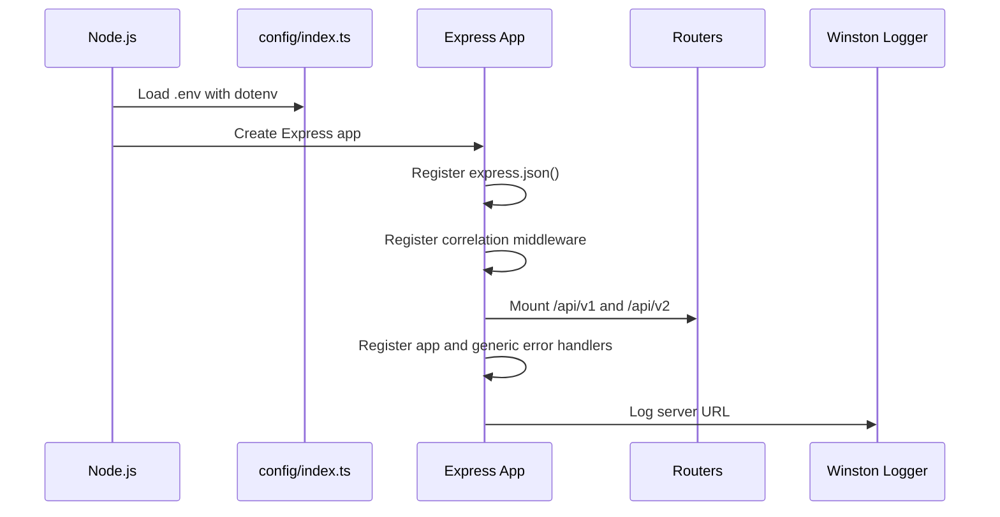

`connectDB()` is defined in `src/config/db.config.ts`, but it is not currently called from `src/server.ts`. Before using repository methods at runtime, the server should connect to MongoDB during startup.

### Request Middleware Flow

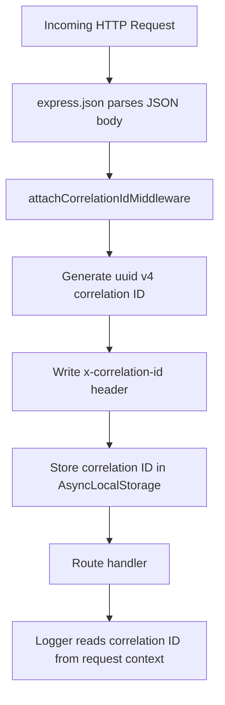

Every request gets a generated correlation ID. The logger includes that ID in each structured log line through `getCorrelationId()`.

### Ping Flow

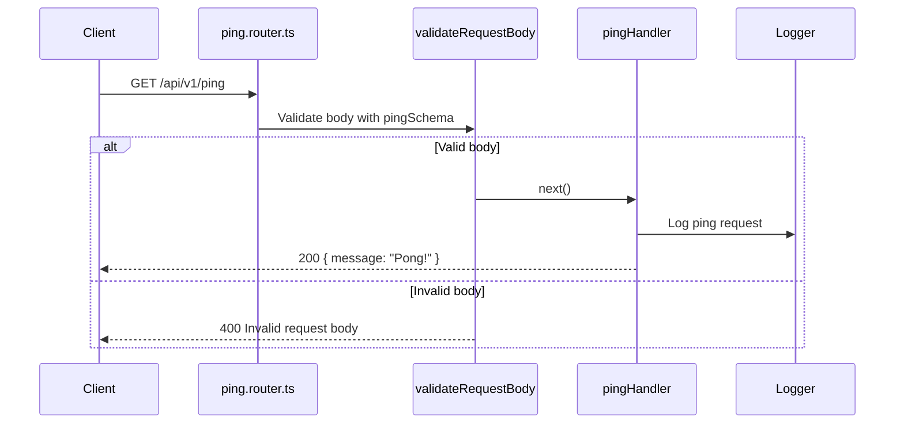

### Health Check Flow

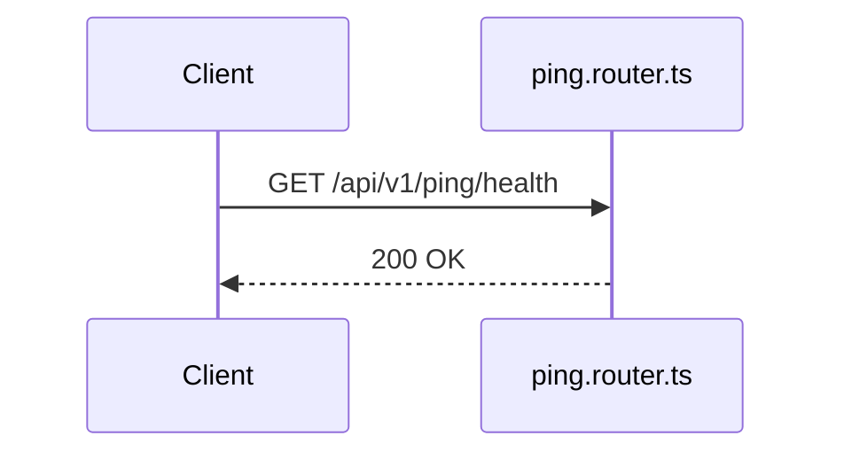

### Create Submission Flow

The core create flow lives in `SubmissionService.createSubmission()`.

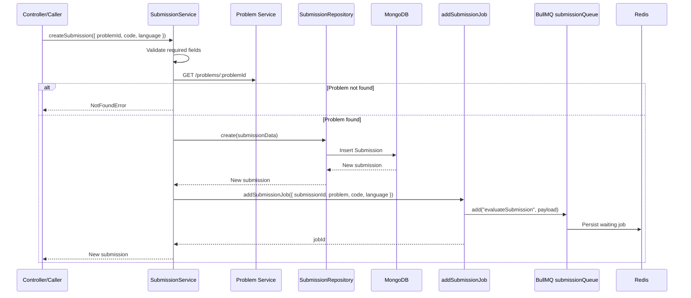

Create submission validation currently checks:

- `problemId` is present.
- `code` is present.
- `language` is present.
- Problem Service returns problem details successfully.

The queue payload contains:

```ts
{
  submissionId: string;
  problem: IProblemDetails;
  code: string;
  language: string;
}
```

### Get Submission By ID Flow

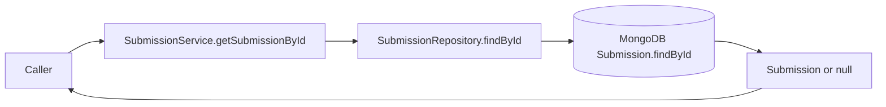

### Get Submissions By Problem Flow

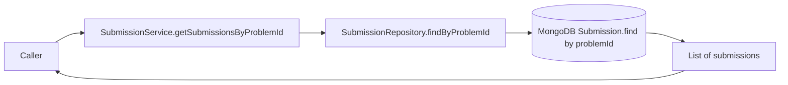

### Update Submission Status Flow

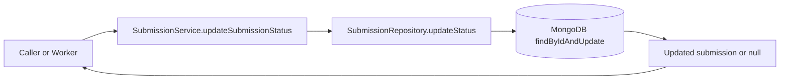

This flow is useful for an evaluation worker after compilation/execution completes.

### Delete Submission Flow

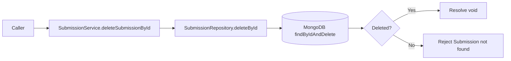

### External Problem Lookup Flow

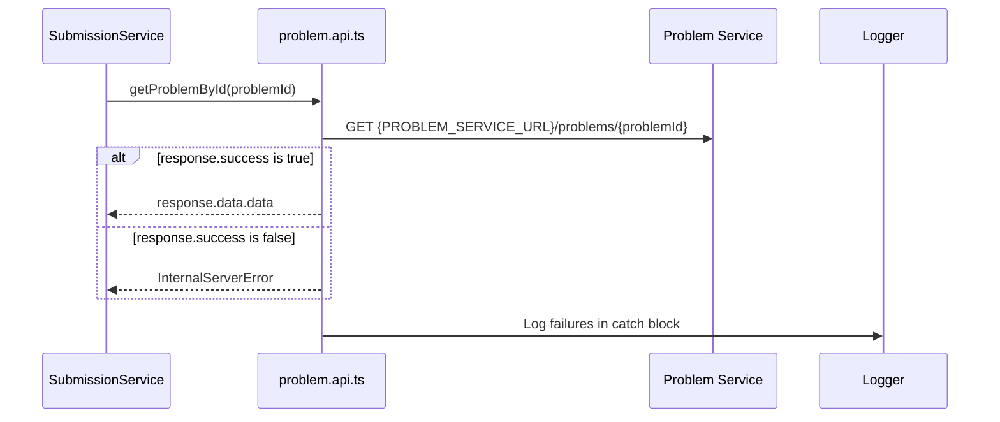

## Queue Behavior

`submissionQueue` is created with:

```ts
new Queue("submissionQueue", {
  connection: createNewRedisConnection(),
  defaultJobOptions: {
    attempts: 3,
    backoff: {
      type: "exponential",
      delay: 3000
    }
  }
})
```

This means:

- Jobs are written to the `submissionQueue` queue.
- Each job is named `evaluateSubmission`.
- Failed jobs can be retried up to 3 times.
- Retries use exponential backoff starting at 3 seconds.
- Queue `error` events are logged.
- Queue `waiting` events are logged.

An evaluation worker is not included in this repository. A worker service should consume `submissionQueue`, execute the submitted code against the provided problem test cases, and update the submission status.

## Logging and Correlation IDs

Logs are emitted as JSON through Winston.

Each log line includes:

- `level`
- `message`
- `timestamp`
- `correlationId`
- additional `data`

Logs are written to:

- Console
- Rotating daily files matching `logs/%DATE%-app.log`

Rotation configuration:

- Date pattern: `YYYY-MM-DD`
- Max file size: `20m`
- Retention: `14d`

## Error Handling

The codebase defines reusable custom errors:

| Error | Status |
| --- | --- |
| `BadRequestError` | `400` |
| `UnauthorizedError` | `401` |
| `ForbiddenError` | `403` |
| `NotFoundError` | `404` |
| `ConflictError` | `409` |
| `InternalServerError` | `500` |
| `NotImplementedError` | `501` |

Middleware flow:

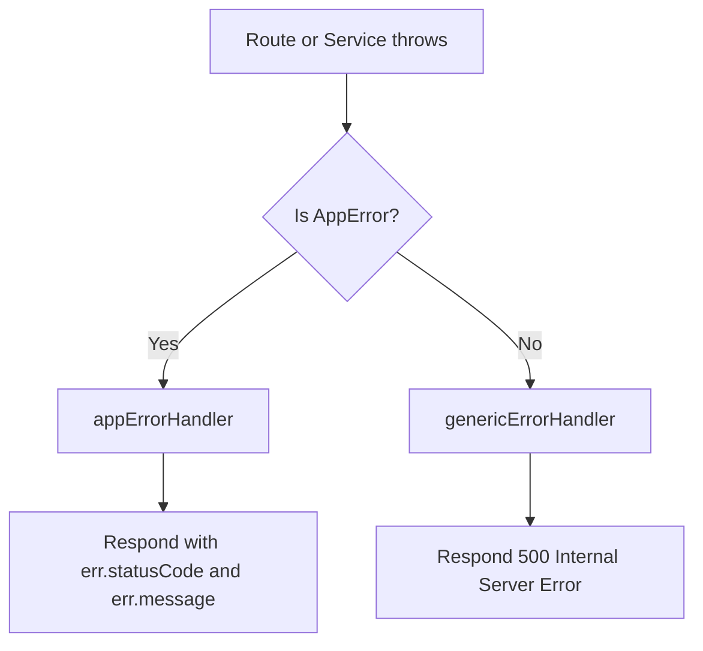

## Development Notes

- Submission service methods are implemented but not exposed by an HTTP submission router yet.
- MongoDB connection setup exists, but server startup does not currently call `connectDB()`.
- BullMQ producer and queue exist, but the queue consumer/evaluation worker is expected to live separately.
- `SubmissionRepository` contains an in-memory `submissions` array that is appended to on create, while reads/writes use MongoDB. That array is not used for lookups.
- There is no test script configured in `package.json` yet.
- TypeScript is configured with `strict: true` and `noUnusedLocals: true`.
